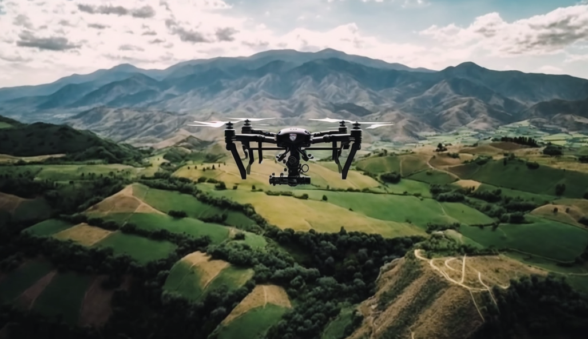

    

# Flywithme

**Pre-release is available now. Click on the `Download Link` button to download the EXE file**

:fire::fire::fire::fire::fire::fire::fire::fire:

## Download link

Flywithme is more than just a drone controller - it's a gateway to the sky. With its sleek and intuitive user interface, Flywithme allows you to take control of your drone and soar to new heights. Whether you're a seasoned drone pilot or a beginner looking to take to the skies for the first time, Flywithme has everything you need to fly with confidence.

Flywithme will greet you with a dynamic battery life indicator and a live video feed from the drone's camera, giving you a front view of the world. With the ability to manoeuvre your drone in any direction with ease, you'll feel like you're flying alongside it as it soars through the air.

But Flywithme isn't just about getting from point A to point B - it's about pushing the boundaries of what's possible with your drone. With just a touch of a button, you can perform aerial tricks and manoeuvres that will leave your friends and family in awe. Whether you're executing flips and turns or taking on daring 30-degree angles, Flywithme puts the power of flight at your fingertips.

But safety is always a top priority, and that's why Flywithme includes an emergency stop button that will immediately bring your drone back to the ground if necessary. And when it's time to land, Flywithme makes it a breeze with a dedicated button that ensures a smooth and controlled descent.

In short, Flywithme is the ultimate drone controller - a tool that allows you to take your drone to new heights and explore the world from above. So, whether you're looking to capture stunning aerial footage or simply experience the thrill of flight, Flywithme is the software you need to make it happen.

## How to operate
Turn on your Tello Edu drone and connect your computer with the Tello drone's Wi-Fi SSD. Once connected
run Flywithme.

## Basic operations

1. Click-on the `Button 1` (takeoff/land) to takeoff or land the drone. Buttons 3 to 11 only operate when after takes off.
2. Click-on the `Button 2` to turn on or off the live video stream from the drone front camera.
3. Click-on any of the `Button 3` to navigate the drone in the space. Front, back, left and right direction. The drone will move at a constant velocity.
4. Click-on `Button 4 to 7` for yaw. `Button 4` and `Button 5` for 90&deg; left or right turn. The other two buttons for 30&deg; left or right turn. The drone will take a constant velocity turn.
5. Click-on `Button 8 to 10` for flip. The first button will do a random flip and the other two are for left and right flips. At this stage, you are only allowed to perform two flips when the battery has enough power.
6. Click-on `Button 11` for emergency landing. It will turn off all the running motors.

## Connection issues

There is a known connection issue. If you run the application, and it is not working, please close the 
application, disconnect from the drone Wi-Fi, reconnect and reopen the application.

