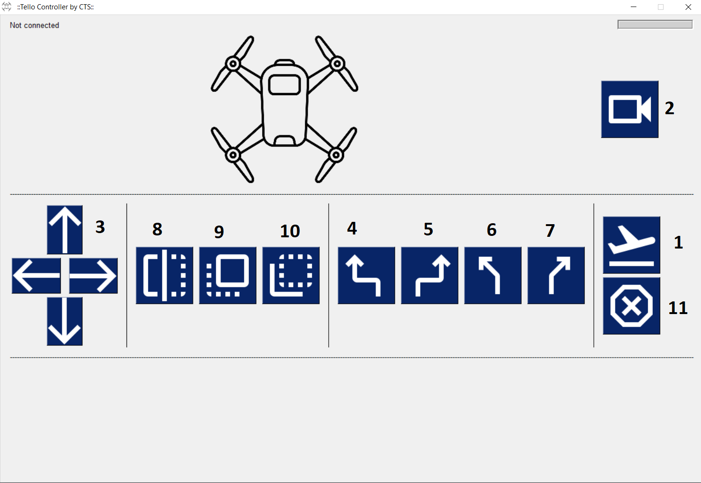

# Tello drone controller

**Pre-release is available now. Checkout the `Releases` section to download the EXE file**

:fire::fire::fire::fire::fire::fire::fire::fire:

## Download link

https://github.com/caseytechschool-cts/Flywithme/releases/download/v1.0.0.0-rc/FlywithME.exe

A Python GUI project by Casey Tech School to control a Tello Edu drone. Ships with a slick user interface and build-in controller 
to easily navigate a Tello Edu drone.

Before running the application, turn on your Tello Edu drone and connect your computer
with the Tello drone's Wi-Fi SSD.

Here is a screenshot of the user interface.

## Basic operations

1. Click-on the `Button 1` (takeoff/land) to takeoff or land the drone. Buttons 3 to 11 only operate when after takes off.
2. Click-on the `Button 2` to turn on or off the live video stream from the drone front camera.
3. Click-on any of the `Button 3` to navigate the drone in the space. Front, back, left and right direction. The drone will move at a constant velocity.
4. Click-on `Button 4 to 7` for yaw. `Button 4` and `Button 5` for 90&deg; left or right turn. The other two buttons for 30&deg; left or right turn. The drone will take a constant velocity turn.
5. Click-on `Button 8 to 10` for flip. The first button will do a random flip and the other two are for left and right flips. At this stage, you are only allowed to perform two flips when the battery has enough power.
6. Click-on `Button 11` for emergency landing. It will turn off all the running motors.

## Connection issues

There is a known connection issue. If you run the application, and it is not working, please close the 
application, disconnect from the drone Wi-Fi, reconnect and reopen the application.

